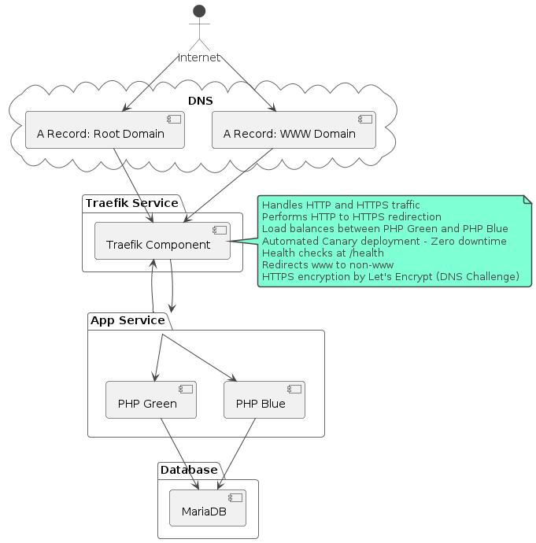

# Blue-Green Deployment with Docker Compose and Traefik

This project demonstrates a blue-green deployment strategy using Docker Compose and Traefik to achieve zero-downtime updates. The setup includes MariaDB with two versions of a PHP application served by Apache, and Traefik routing traffic.



## Table of Contents
- [Directory Structure](#directory-structure)
- [Running the Services](#running-the-services)
- [Updating the Application with Zero Downtime](#updating-the-application-with-zero-downtime)
- [Implementing Failover Mechanism](#simulate-failover-mechanism)
- [Generate a user password for dashboard auth](#generate-a-user-password-for-dashboard-auth)
- [Letsencrypt DNS Challenge](#letsencrypt-dns-challenge)
## Directory Structure

```
.
├── Dockerfile.blue
├── Dockerfile.green
├── README.md
├── docker-compose.yml
├── src
│   ├── blue
│   │   ├── .htaccess
│   │   ├── health.php
│   │   └── index.php
│   └── green
│       ├── .htaccess
│       ├── health.php
│       └── index.php
├── status.ps1
└── traefik
    ├── dynamic.yml
    ├── middleware.yml
    └── tls.yml
```

## Running the Services
1. **Update Domain Configuration** - Edit the following files to match your domain:
   ```
   - traefik/dynamic.yml
   - docker-compose.yml (for the Traefik dashboard on Traefik's container)
   ```

2. Start the services in detached mode:
`docker-compose up -d`

3. Access the green and blue pages at : http://app.localhost (or your specified domain)

4. Traefik dashboard should be accessable at : http://traefik.app.localhost

## Updating the Application with Zero Downtime
### Blue-Green Deployment Strategy

1. *Health Checks*: Each service (Blue and Green) is equipped with health checks. Traffic automatically shifts to the healthier service in real-time.
- Healthchecks can be accessed via:
  - `/health`

2. *Failover Implementation*: If a service fails its health check, Traefik automatically redirects traffic to the other service. **(See section below)**

## Simulate Failover mechanism
1. To test the failover mechanism, manually stop the primary service (php-blue). This simulates a failure, allowing us to observe how Traefik handles the transition to the backup service:

- `docker stop php-blue`

2. Monitor Failover Process

  - Check the logs of the Traefik container to observe the failover process. You should see logs indicating that the health check for php-blue fails and that Traefik reroutes the traffic to php-green:

  - `docker logs traefik -f`

3. Health check should fail and traefik will automatically direct all traffic to the backup server until the instance is healthy again

**Execute the `status.ps1` script to verify server availability.**

## Generate a user password for dashboard auth
1. Run the following command :

- `echo $(htpasswd -nb username password) | sed -e 's/\$/\$\$/g'`

2. Add the following labels on traefik : 

- `- "traefik.http.middlewares.auth.basicauth.users=OUTPUT"` 

- replace OUTPUT with the string given from the first command.

3. Make sure you've referenced the authentication by adding the following labels : 

   ```
   - "traefik.http.routers.https.service=api@internal"
   - "traefik.http.routers.https.middlewares=auth"
   ```
4. Accessing the dashboard URL should now be secured with a username/password.

## Letsencrypt DNS Challenge
Authentication for the Let's Encrypt DNS Challenge happens using AWS Credentials. These credentials can be passed directly through the CLI or configured via IAM roles directly on the EC2 instance.

### Environment Variables
The `docker-compose.yml` file utilizes the following environment variables for AWS credentials:
```yaml
    environment:
      - AWS_ACCESS_KEY_ID=${AWS_ACCESS_KEY_ID}
      - AWS_SECRET_ACCESS_KEY=${AWS_SECRET_ACCESS_KEY}
      - AWS_REGION=${AWS_REGION}
```

### Steps to Set Up
1. Export AWS Credentials:

Before running Docker Compose, ensure that the required environment variables are set in your terminal:
```
export AWS_ACCESS_KEY_ID=ACCESS_KEY
export AWS_SECRET_ACCESS_KEY=SECRET_KEY
export AWS_REGION=AWS_REGION
```

This setup ensures that your AWS credentials are securely passed to the Traefik container, allowing it to perform DNS-01 challenges with Let's Encrypt.